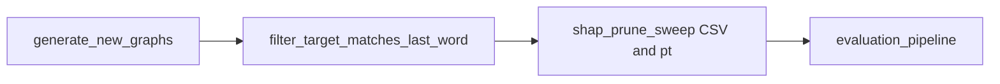

# shap_prune evaluation pipeline

## Context (what already exists)

- **Graph download**: [demos/generate_new_graphs.py](demos/generate_new_graphs.py) calls [api.py](api.py) `generate_graph` (Neuronpedia; requires `NEURONPEDIA_API_KEY` in [config.py](config.py)) and writes `demos/temp_graph_files/<source_set>/*.json`. Prompts are truncated (last word dropped) before the API call, matching the intended next-token target.
- **Target token id from JSON**: [summarization/token_attribution.py](summarization/token_attribution.py) `_cached_prompt_payload_from_graph` reads `is_target_logit` → `feature` as `target_token_id` (same source you should use for filtering).
- **Normalizations**: `NormalizeMethod` already includes `softmax`, `relu_l1`, `entmax15` (plus `sparsemax`) in [summarization/token_attribution.py](summarization/token_attribution.py). `_cached_model` / `_cached_tokenizer` reuse the HF model across graphs on a fixed `(model_name, device)`.
- **Pruning + “combined graph scores”**: [summarization/prune.py](summarization/prune.py) `prune_graph_pipeline` + `save_prune_graph`; post-hoc metrics are `compute_combined_prune_graph_scores` → `(combined_retention, combined_completeness_score)` (influence/relevance blend on the pruned graph).
- **Clustering metrics today**: [summarization/auto_grouping.py](summarization/auto_grouping.py) `score_k` already computes **silhouette** (raw + `silhouette_norm`) and **dag_score**; `total = (sil_norm + dag_score) / 2`. Legacy `w_intra` etc. are ignored in scoring but still appear in CLI/manifest for [evaluation_pipeline.py](evaluation_pipeline.py).
- **Batch prune driver**: [demos/run_prune_with_shap.py](demos/run_prune_with_shap.py) — argparse currently only allows `softmax`/`sparsemax` for `--normalize-method` and defaults `--edge-threshold` to `0.98`; it does not sweep node thresholds or log combined scores.

## 1. Dataset preparation

1. **Download graphs** (when you are ready to execute, not in plan-only mode): from repo root, `python demos/generate_new_graphs.py` (adjust `MAX_PROMPTS`, `SOURCE_SETS`, `PROMPTS_FILE` in-script if you need a larger set). Ensure API key and network access.
2. **Filter JSONs** so the graph’s target logit matches the **last word of the full prompt line** in [demos/prompts2.txt](demos/prompts2.txt) (the word removed by `load_prompts` before download):
   - For each graph, read `target_token_id` via the same logic as `_cached_prompt_payload_from_graph`.
   - Load the tokenizer for the same model used for SHAP (e.g. `google/gemma-2-2b` aligned with `DEFAULT_MODEL` / `--model-name`).
   - Define a small, explicit match rule (document it in code): e.g. normalize whitespace/case on the last word, then require `target_token_id` to equal the **first** token id of `tokenizer(" " + last_word, add_special_tokens=False)["input_ids"]` (or decode-compare if you prefer string equality after stripping `Ġ`/`▁` prefixes for subword tokenizers). Move or symlink passing JSONs into a dedicated folder (e.g. `demos/temp_graph_files_filtered/<source_set>/`) so downstream scripts only see consistent graphs.

## 2. Token attribution + pruning sweep

**Goal**: For each filtered graph, for `normalize_method ∈ {softmax, relu_l1, entmax15}`, `edge_threshold = 0.95`, and `node_threshold ∈ {0.0, 0.1, …, 1.0}`:

- Compute token weights once per `(graph, normalize_method)` via `get_token_attribution_from_graph(...)` (model stays warm thanks to `_cached_model`).
- Run `prune_graph_pipeline` + `save_prune_graph` (same pattern as [demos/run_prune_with_shap.py](demos/run_prune_with_shap.py)).
- Record: `graph_name`, `source_set`, `normalize_method`, `node_threshold`, `edge_threshold`, `num_nodes`, `num_edges`, `combined_retention`, `combined_completeness_score` from `compute_combined_prune_graph_scores(prune_graph)` (pick explicit defaults for `method`/`normalization`/`alpha` to match your Streamlit / paper convention—e.g. geometric + min_max + 0.5 unless you standardize elsewhere).

**Implementation approach** (minimal surface area):

- Add a **single driver script** under `demos/` (e.g. `demos/shap_prune_sweep.py`) that implements the nested loops, writes a **CSV** (and optional JSON lines) under something like `eval_outputs/shap_prune/summary.csv`, and writes pruned artifacts under a predictable tree, e.g. `eval_outputs/shap_prune/pruned/<norm>/tnode_<thr>/<dataset>__<stem>_prune_graph.pt` so `*_prune_graph.pt` stays discoverable by [evaluation_pipeline.py](evaluation_pipeline.py)’s `_discover_prune_graphs`.
- Optionally extend [demos/run_prune_with_shap.py](demos/run_prune_with_shap.py) `choices` for `--normalize-method` to include `relu_l1` and `entmax15` for ad-hoc runs; the new sweep script can import helpers from there to avoid duplication.

## 3. Clustering evaluation (silhouette, dag_score, DBCV)

1. **Integrate Moulavi DBCV** into the post-clustering score path:
   - Evaluate a maintained Python port (e.g. [FelSiq/DBCV](https://github.com/FelSiq/DBCV) or [christopherjenness/DBCV](https://github.com/christopherjenness/DBCV)) for API fit (expects distance matrix + integer labels). Pin the chosen package in [requirements.txt](requirements.txt) or vendor a single module if you want zero new deps.
   - In [summarization/auto_grouping.py](summarization/auto_grouping.py) `score_k`, after building middle-node cluster labels (same construction as `_silhouette_over_middle`), build a **precomputed distance** matrix on those middle nodes: `D = 1 - S` with the same symmetrization/clipping as silhouette, diagonal zeros. Call DBCV; on failure (too few clusters, degenerate MST, etc.) return `nan` or a sentinel and document behavior.
   - Extend the `score_k` return dict with `dbcv` (raw). Optionally define a normalized DBCV for a combined score later; the command only asks to **report** the three metrics.

2. **Plumb into the evaluation pipeline**:
   - Add `dbcv` to `SUMMARY_COLUMNS` and `_flatten_metrics` in [evaluation_pipeline.py](evaluation_pipeline.py).
   - Remove or gate noisy `print` in `score_k` ([summarization/auto_grouping.py](summarization/auto_grouping.py) line ~229) when running batch eval, or route through `logging`, so sweeps stay readable.

3. **Run clustering eval** on the pruned `.pt` tree from step 2:

   `python evaluation_pipeline.py --input-path eval_outputs/shap_prune/pruned/... --output-dir eval_outputs/shap_prune/clustering/...`

   (Repeat or point `--input-path` at each normalization subtree if you want separate summaries.)

## 4. Execution order (when implementing)

## Risks / notes

- **Subword alignment**: “Last word” vs `target_token_id` must be handled carefully for Gemma/BPE; encode the surface form of the last word and compare token ids explicitly.
- **DBCV edge cases**: May be undefined for single-cluster or all-singleton partitions; handle gracefully in `score_k`.
- **Runtime**: SHAP per graph dominates; the sweep multiplies by 3×11 runs per graph—caching token weights to disk per `(graph, norm)` avoids recomputing SHAP when retrying prune thresholds only.
